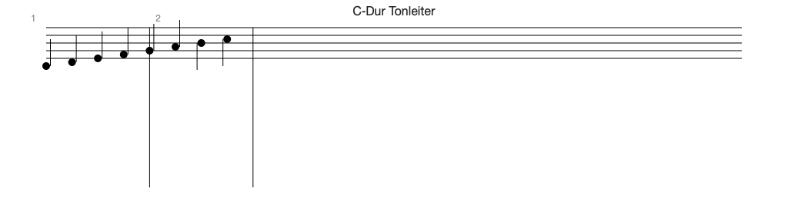

# ScoreKit  [](https://github.com/Fountain-Coach/ScoreKit/actions/workflows/ci.yml)



Watch as MP4 (smoother): Docs/scorekit-demo.mp4

Swift library unifying LilyPond engraving (publication-quality) with real‑time Swift rendering and AudioTalk semantics.

Highlights
- LilyPond wrapper for canonical engraving (PDF/SVG) — not bundled on iOS
- Swift native renderer (SwiftUI/CoreGraphics) for interactive editing
  - Incremental layout with per-measure partial reflow and neighbor-span expansion
- Semantic tags (`AudioTalk.*`) to bridge notation ↔ performance
- Designed for integration with Fountain‑Coach (AudioTalk, Fountain‑Store, Teatro)

Getting Started
- SwiftPM: add this repo as a dependency, use `ScoreKit` and `ScoreKitUI` targets
- macOS/iOS: `ScoreView` (placeholder) composes a basic SwiftUI view
  - `ScoreView` uses incremental reflow to keep edits responsive
- LilyPond pipeline will be enabled on macOS/Linux in upcoming milestones

Roadmap
- See `AGENTS.md` for architecture, milestones (M0–M8), and conventions

**In Plain English**
- Think of ScoreKit as two things working together:
  - A printing brain: It speaks LilyPond to make publication‑quality sheet music when you need it.
  - A live whiteboard: A fast, native view that draws notes instantly and updates only the parts you touched.
- What this means today:
  - You can render a simple score on screen, click/drag to select notes, and see lightweight highlights and tooltips.
  - You can add basic musical markings (slurs, hairpins, dynamics, articulations) via the included inspector UI and watch the score update smoothly.
  - Edits are snappy: the renderer only re‑lays out affected measures and shifts what follows, so most changes feel immediate.
  - A tiny playback path converts notes to MIDI 2.0 UMP messages so you can wire them to a device or print them for debugging; basic playhead following is included.
  - A LilyPond wrapper can emit `.ly` and, if LilyPond is installed, produce PDF/SVG for high‑quality output (tests default to a no‑exec mode).
- A small LilyPond import subset can read back simple snippets and round‑trip core markings.
- What this is not (yet): a full notation editor or DAW replacement. It’s a focused toolkit for coaching, annotation, playback hooks, and fast UI feedback.

AudioTalk Preview (Core Flow)
- ScoreKit previews what AI (AudioTalk/FountainAI) changes in your score.
- The AI sends structured ops (slur, hairpin, articulation, dynamic). ScoreKit applies them and reflows just what’s needed.
- Use `AudioTalkPreviewSession` to apply ops and get changed indices for highlighting and incremental layout. The demo includes a “Run AI Preview” action.

Example
```
let session = AudioTalkPreviewSession(events: events)
let ops: [PatchOp] = [
  .hairpin(start: 0, end: events.count - 1, type: .crescendo),
  .slur(start: 4, end: 7),
  .dynamic(index: 0, level: .mp)
]
let (updated, changed) = session.apply(ops: ops)
// Pass 'updated' to ScoreView; use 'changed' for updateLayout + highlight
```

Try It
- Demo app (macOS): `cd ScoreKit && swift run ScoreKitDemo`
  - Select notes, draw a range, apply hairpins/dynamics in the inspector, and see the view update incrementally.
  - Use the buttons to flash/pulse selections or dump MIDI 2.0 UMP words to the console.
- Benchmarks: `cd ScoreKit && swift run ScoreKitBench` (CI publishes `bench.txt` artifacts and soft perf warnings).

Current Limitations
- Playback scheduling sends immediately (no JR timestamps yet); device routing is minimal.
- Renderer covers common single‑staff cases; complex beaming/compound meters continue to improve.
- Lily import supports a subset; complex multi‑voice/rest tie cases are still being extended.

Performance & Benchmarks
- Run renderer microbenchmarks locally: `cd ScoreKit && swift run ScoreKitBench`
- CI runs ScoreKitBench in release mode and uploads `bench.txt` as an artifact.
- Soft perf checks annotate the run with warnings if any sample exceeds 50 ms (non-failing).
 - View CI results and artifacts: https://github.com/Fountain-Coach/ScoreKit/actions/workflows/ci.yml
 - Override thresholds via Workflow Dispatch inputs (ms): `layout_warn_ms`, `update_warn_ms`, `default_warn_ms`.

Incremental Layout
- `SimpleRenderer.updateLayout(previous:events:in:options:changed:)` reflows only the affected measures and shifts the suffix.
- Neighbor-span expansion: if changes intersect slurs, hairpins, or beam groups, the reflow window expands to cover the whole span.
- `ScoreView` caches the last `LayoutTree` and event hashes, computes changed indices, and calls `updateLayout` automatically.

License
- TBD
